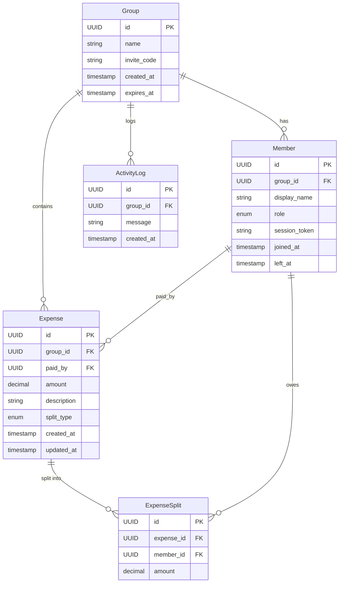

# Tabby — Technical Design Spec

A no-auth expense splitting PWA. Create a group via shareable link, add expenses with flexible splits, and get a simplified breakdown of who owes who — minimizing total settlement transactions.

**Primary goal:** Portfolio project and interview talking point, with potential to ship to real users.

---

## User Flow

1. Alice opens Tabby and creates a new group ("Ski Trip 2026")
2. She gets a shareable link (e.g., `tabby.app/g/x7Kp9m`)
3. Alice shares the link with Bob and Carol
4. Bob opens the link, enters his name, and is added to the group
5. Alice adds a $150 dinner expense, split equally three ways
6. Bob adds a $60 gas expense, split between himself and Carol
7. Everyone sees a live balance dashboard: net debts and a simplified settlement plan
8. Carol sees she owes Alice $50 and Bob $30 — two transactions to settle up

---

## Core Features (v1)

- **Group creation** via shareable link, no signup or account required
- **Flexible expense splitting:** equal, exact amounts, or percentage-based
- **Real-time balance dashboard** showing net debts per person
- **Debt simplification algorithm** to minimize settlement transactions
- **Installable PWA** on mobile and desktop via service workers and web manifest

---

## Debt Simplification Algorithm

This is the technical centerpiece of the project.

**Problem:** Given N people with various debts between them, find the minimum number of transactions to settle all balances.

**Approach:** Model balances as a directed graph. Compute each person's net balance (total owed to them minus total they owe). Then greedily match the max creditor against the max debtor, settling the smaller of the two amounts, and repeat until all balances are zero.

**Example:**
- Alice is owed $80 total, Bob owes $50, Carol owes $30
- Settlement: Bob pays Alice $50, Carol pays Alice $30 (2 transactions instead of potentially more)
- In the API response, amounts are returned as **integer cents**: `{ from: "bob", to: "alice", amount: 5000 }`. Divide by 100 to get dollars.

**Why greedy works here:** A greedy algorithm makes the locally optimal choice at each step — here, always pairing the largest creditor with the largest debtor. It doesn't backtrack or explore every possible combination, which is what makes it fast (O(n log n)). The exact minimum-transaction problem is NP-hard, meaning the time to compute the perfect answer grows exponentially with group size — it's in the same class of problems as the travelling salesman. For groups under ~20 people, greedy consistently produces optimal or near-optimal results in negligible time, making the theoretical gap irrelevant in practice.

**Tradeoffs considered:**
- Greedy vs. exact (NP-hard) — greedy is O(n log n) and good enough for small groups
- Net-balance approach vs. tracking individual debts — net-balance is simpler and what users actually care about

---

## Split Validation & Balance Computation

### Split Validation

Validation happens in two layers:

1. **Fastify route schema (structural):** Checks that required fields exist and have correct types.
2. **Service layer (business logic):** Before writing to the database, validates invariants:
   - `equal` — splits are computed server-side; client does not submit individual amounts. Example: Alice submits a $150 dinner split equally among 3 people. The client just sends `{ amount: 150, split_type: "equal", members: [alice, bob, carol] }` — no per-person amounts. The server divides $150 ÷ 3 = $50 and writes three `ExpenseSplit` records itself. This avoids the problem of clients rounding differently (e.g., one client sends $49.99/$50.00/$50.01) and ensures the math is always consistent.
   - `exact` — submitted split amounts must sum to the expense total (±1 cent tolerance for rounding)
   - `percentage` — submitted percentages must sum to 100%; server converts to amounts before storing. When percentages don't divide evenly into whole cents, the remainder is added to the first member in the split array (e.g., splitting $1.00 three ways at 33.33%/33.33%/33.34% gives the first member the extra cent).

All arithmetic is performed in integer cents internally to avoid floating-point errors, then converted to `DECIMAL(10,2)` for storage.

### Balance Computation

Balances are computed **on-the-fly** by querying all `ExpenseSplit` records for the group and aggregating in the service layer — no cached or materialized balance. This is correct and fast for v1 group sizes (≤50 members, ≤reasonable expense count). Caching introduces a synchronization problem: the cache must be invalidated any time an expense is added, edited, or deleted — and if two people write simultaneously, a stale cache can serve wrong balances. Recomputing from raw records is always correct and takes milliseconds at this scale, so the cache would add complexity with no real benefit yet.

**v2 option:** Materialized balance view updated via application-level event on each expense write. Worth adding if query latency becomes measurable. Interesting interview talking point: why you'd defer this optimization and what the trigger would be.

---

## Identity & Session Design

**Approach:** Name entry per group + browser-local token

When a user opens a group link and enters their name, the server generates a session token stored in the browser as an **httpOnly cookie**. This token "claims" that name within the group.

**Why httpOnly cookie over localStorage:** A cookie is a small piece of data the browser stores and automatically sends with every request to the relevant server — you don't need any JavaScript to manage it, the browser handles it transparently. The `httpOnly` flag on a cookie tells the browser: "don't let JavaScript read or touch this, ever." That matters because of XSS (Cross-Site Scripting) attacks — if a malicious script somehow gets injected into the page, it can read everything in `localStorage` and steal session tokens. An `httpOnly` cookie is completely invisible to JavaScript, so even a successful XSS attack can't extract it. For a no-auth app handling financial data, this is the correct default.

**Token storage:** The plaintext token is sent to the browser as an httpOnly cookie. Before being written to the database, it is hashed with SHA-256 — the database never stores the raw token. If the database is compromised, the stored hashes cannot be used to forge sessions.

**What this gives us:**
- No signup friction — just enter a name and go
- Returning users on the same browser are recognized automatically
- Prevents casual impersonation (someone else can't add expenses as "Alice" without her token)

**Known limitations:**
- Switching devices loses your session (no way to reclaim without auth)
- Clearing browser data loses identity
- Deliberately sharing your token lets someone impersonate you

**Why not go further:**
- Magic links add friction that conflicts with the "instant, no-signup" pitch
- Full auth (OAuth, email/password) is overkill for a trip expense splitter and changes the product identity entirely

---

## Data Model



```
Group
├── id (UUID)
├── name ("Ski Trip 2026")
├── invite_code (short random string for shareable URLs)
├── created_at
└── expires_at (updated on every new expense — 90 days from last activity)

Member
├── id (UUID)
├── group_id (FK → Group, cascade delete)
├── display_name ("Alice")
├── role (owner | admin | member)
├── session_token (hashed)
├── joined_at
└── left_at (nullable — set when member leaves, keeps balance in ledger)

Expense
├── id (UUID)
├── group_id (FK → Group, cascade delete)
├── paid_by (FK → Member, restrict delete)
├── amount (DECIMAL(10,2) — never FLOAT; avoids floating-point rounding errors for financial data)
├── description ("Dinner at Moose Lodge")
├── split_type (equal | exact | percentage)
├── created_at
└── updated_at

ExpenseSplit
├── id (UUID)
├── expense_id (FK → Expense, cascade delete)
├── member_id (FK → Member, restrict delete)
└── amount (DECIMAL(10,2) — the share this member owes)

ActivityLog
├── id (UUID)
├── group_id (FK → Group, cascade delete)
├── message ("Alice is now the group owner")
└── created_at
```

---

## Tech Stack & Architecture

### Why These Choices

| Choice | Why | Over What |
|--------|-----|-----------|
| **TypeScript** | Type-safety across the full stack — shared types between frontend and backend, Drizzle's inferred types compose with TypeScript throughout the stack, catches entire classes of bugs at compile time | Plain JavaScript |
| **Fastify** | ~3x faster than Express, built-in JSON Schema validation, `@fastify/swagger` generates OpenAPI docs from route schemas automatically, better DX for API-first apps | Express |
| **PostgreSQL via Neon** | Relational model fits the data well (groups → members → expenses → splits). ACID transactions for financial data. Neon provides serverless PostgreSQL — same semantics, no VPC or connection pooling required, and a free tier that replaces RDS entirely. | DynamoDB (poor fit for relational queries, despite being AWS-native) |
| **React + Tailwind** | Industry standard, fast to build with, strong PWA ecosystem | Vue, Svelte (less resume signal) |
| **Drizzle ORM** | Lightweight TypeScript ORM with schema-as-code and a SQL-first query builder. Drizzle-kit manages versioned migrations; the Neon HTTP driver (`@neondatabase/serverless`) is stateless and bundles into the Lambda zip without native binaries. | Prisma (heavier runtime, native binary concerns on Lambda), Knex (no type inference), raw SQL (too manual) |
| **TanStack Query** | Declarative server-state management — handles caching, polling, background refetches, and online/offline coordination. Replaces manual `useState` + `useEffect` fetch patterns. | SWR (less feature-rich), manual fetch + state (no caching, no deduplication) |
| **PWA** | Single codebase for web + mobile install, offline-capable | React Native (separate build pipeline, overkill for this) |
| **OpenAPI / Swagger** | Auto-generated from Fastify route schemas via `@fastify/swagger`. Documents the API contract, enables future client generation, demonstrates API-design thinking. | Hand-written docs (drift from code), no docs at all |

### AWS Architecture

AWS is a deliberate learning goal — demonstrating cloud-native deployment patterns.

- **Lambda + API Gateway:** Serverless API layer. Cold start mitigation via provisioned concurrency on critical paths (group creation, expense submission).
- **Neon (serverless PostgreSQL):** Serverless Postgres accessed via Neon's HTTP driver (`@neondatabase/serverless`). Stateless by design — no connection pool configuration needed, no VPC required. Lambda connects over HTTPS on each invocation; the driver bundles into the Lambda zip with no native binaries. Eliminates the ~$13–15/mo RDS cost after the AWS free tier expires.
- **Cloudflare Pages:** Static hosting for the React PWA. Cloudflare Pages provides CDN, HTTPS, and SPA routing out of the box — with unlimited free bandwidth and no expiring free tier. Chosen over CloudFront + S3 because AWS's free tier expires after 12 months, and Cloudflare simplifies deployment to a single `wrangler pages deploy` command (no S3 sync + cache invalidation).
- **Secrets management:** The Neon connection string and other secrets are stored in **AWS SSM Parameter Store** (free tier) and fetched at Lambda cold start, then cached in memory. Never passed as plain environment variables in production. SSM Parameter Store keeps secrets encrypted at rest, access-controlled via IAM, and auditable (you can see who fetched a secret and when). Lambda fetches the value once at cold start and holds it in memory for the lifetime of that instance — it's never written to logs and never appears in the Lambda configuration visible in the console.
- **Infrastructure as Code:** Terraform — more portable than CDK/CloudFormation, widely adopted across the industry, and adds a non-AWS-specific skill to the resume. State is stored in **Terraform Cloud** (free for up to 500 resources) — chosen over an S3 backend to eliminate another expiring AWS free tier dependency while gaining built-in state locking, versioning, and a UI for state inspection. Terraform manages: Lambda function + IAM role, API Gateway (HTTP API), SSM Parameter Store entries.

**Architecture decisions to discuss in interviews:**
- Lambda cold starts and why Neon's HTTP driver eliminates the connection pool problem entirely (no VPC, no pool config, stateless per invocation)
- Why Neon over RDS: serverless billing, no VPC overhead, same PostgreSQL semantics, permanently free at this scale
- Why relational (PostgreSQL) over DynamoDB despite being on AWS (data model fit > vendor alignment)
- Why Cloudflare Pages over CloudFront + S3 (no expiring free tier, simpler deploy pipeline)
- Why Terraform Cloud over S3 backend (free state locking, no DynamoDB table, no expiring free tier)
- Why SSM Parameter Store over environment variables for secrets (rotation, audit trail, no accidental logging)

---

## API Surface

REST API served via Fastify. All routes are prefixed `/api/v1`. OpenAPI docs auto-generated via `@fastify/swagger` at `/docs`.

| Method | Path | Auth | Description |
|--------|------|------|-------------|
| `POST` | `/groups` | None | Create a new group; returns group + owner session token |
| `GET` | `/groups/invite/:inviteCode` | None | Fetch group metadata by invite code (for join page) |
| `POST` | `/groups/invite/:inviteCode/join` | None | Enter a name, receive a session token |
| `GET` | `/groups/:id` | Session token | Fetch group name and invite code by stable ID (for settings page) |
| `GET` | `/groups/:id/members` | Session token | List active members |
| `DELETE` | `/groups/:id/members/:memberId` | Admin+ | Remove a member |
| `POST` | `/groups/:id/expenses` | Session token | Add an expense with splits |
| `GET` | `/groups/:id/expenses` | Session token | List all expenses |
| `PATCH` | `/groups/:id/expenses/:expenseId` | Session token | Edit an expense (owner of expense or admin) |
| `DELETE` | `/groups/:id/expenses/:expenseId` | Session token | Delete an expense (owner of expense or admin) |
| `GET` | `/groups/:id/balances` | Session token | Compute and return net balances + settlement plan. `Balance.netCents` and `Settlement.amount` are **integer cents**. Intentionally includes ghost members (those who left) so the ledger stays accurate after someone leaves. |
| `PATCH` | `/groups/:id/settings` | Owner | Update group name, invite link |
| `GET` | `/groups/:id/activity` | Session token | Fetch activity log (ownership transfers, etc.) — returns the 50 most recent entries, no pagination |

**Auth model:** Session token passed as an httpOnly cookie. Middleware resolves the token to a `Member` record and attaches it to the request context. Permission checks (role enforcement) happen in route handlers, not the UI.

---

## Link Security & Group Lifecycle

- **Invite codes** are generated with `crypto.randomBytes(6).toString('base64url')` (Node built-in, no dependencies) — ~48 bits of entropy, brute-force resistant at the given rate limits. Not UUIDs in the URL — shorter and cleaner.
- **Rate limiting** on group joins to prevent brute-force link guessing
- **Group expiration:** Groups expire 90 days after the last expense was added (activity-based, not creation-based). Expired groups reject all write operations (`POST /expenses`, `POST .../join`, etc.) with `410 Gone`; read endpoints (`GET /balances`, `GET /expenses`) continue to work. Data is soft-deleted 30 days after expiration (v2 — not yet implemented). No "never expires" toggle — adds settings UI complexity not worth the v1 investment.
- **No sensitive data in URLs** — the invite code maps to a group, but session tokens are never in the URL
- **Abuse mitigation:** Max 50 members per group, max $10,000 per individual expense. Rate limits: global 100 requests/minute per IP; 30 expense submissions/hour per member; 10 group joins/minute per IP. No reporting mechanism in v1 — group owner can remove bad actors.

---

## Permissions & Roles

Three roles, enforced server-side:

**Owner** (the person who created the group):
- All admin permissions
- Manage group settings (name, expiration, invite link regeneration)
- Promote members to admin, demote admins back to member
- Cannot be removed from the group
- **Ownership recovery:** If the owner loses their session token (new device, cleared storage), ownership automatically transfers to the first available admin, or if no admins exist, to the earliest-joined active member — triggered lazily the next time an owner-level action is attempted (not immediately, to avoid unnecessary promotions). There is no manual claim action; the transfer happens automatically and silently. The transfer is recorded as a group activity feed entry (e.g., "Alice is now the group owner") so members are aware of the change without a separate notification system.

**Admin** (promoted by the owner):
- Add and remove members
- Add, edit, and delete any expense in the group
- Cannot modify group settings or manage other admins

**Member** (default role on joining):
- Add expenses
- Edit and delete only their own expenses
- View all balances and settlement plan

**Why this matters for interviews:** This is a lightweight RBAC model — simple enough to implement with a single `role` column on the Member table, but it demonstrates thinking about authorization, not just authentication. Permission checks happen at the API layer (middleware), not in the UI alone.

---

## Real-Time Updates

**v1: Polling via TanStack Query**
- Dashboard polls all data (members, expenses, balances) every 12 seconds via TanStack Query's `refetchInterval`
- `refetchIntervalInBackground: false` pauses polling when the tab is hidden — equivalent to the Page Visibility API behaviour, handled automatically by TanStack Query
- `onlineManager` wired to the browser's native `online`/`offline` events pauses all queries when the device is offline — no wasted requests, no failed mutations queued up
- Simple, reliable, works with Lambda's request-response model. Polling means the client asks the server "anything new?" on a repeating timer. For groups of 5–10 people, polling is indistinguishable from real-time.

**v2: WebSockets**
- Migrate to API Gateway WebSocket APIs for push-based updates
- Better UX but adds complexity (connection management, Lambda integration)

**Why not WebSockets from day one:**
- Polling is simpler to implement and debug
- Lambda + WebSocket API requires managing connection IDs and a DynamoDB connection store
- For groups of 5-10 people, polling is indistinguishable from real-time

---

## PWA Strategy

- **Service worker:** Cache app shell for offline access; show cached balances with "last updated" indicator when offline
- **Web manifest:** Installable on Android and iOS home screens
- **Offline behavior:** Users can view cached balances but cannot add expenses offline (v1 — offline queue is a v2 consideration)

---

## CI/CD Pipeline

**GitHub Actions** — a learning goal in itself, and the industry default for open-source and small-team projects.

**Pipeline stages:**
1. **On PR:** Lint (ESLint) → Unit tests → Integration tests → Schema drift check → Build check
2. **On merge to main:** Full test suite → Build → Deploy to production

**Deployment flow:**
- Terraform applies infrastructure changes (manual approval gate for production)
- Lambda functions packaged and deployed via GitHub Actions + AWS CLI
- React PWA built and deployed to Cloudflare Pages via `wrangler pages deploy`

**Why this matters:** Demonstrates end-to-end ownership — not just writing code, but shipping it safely with automated quality gates.

---

## Testing Strategy

Tests are organized into three tiers by scope and speed. The goal is confidence in core functionality, not coverage percentages. Each tier uses a different framework suited to what it's testing.

Focus on making sure core functionality works, not chasing coverage numbers.

**Tier 1 — Unit tests (debt simplification algorithm):**
- This is the most testable and most important piece
- Test cases: simple 2-person split, multi-person with uneven balances, edge cases (everyone owes equally, single person paid everything, zero-sum groups)
- Framework: Vitest

**Tier 2 — Integration tests (API endpoints):**
- Test the critical API paths: create group, join group, add expense, get balances, delete expense
- Verify permission enforcement (member can't delete someone else's expense, non-admin can't remove members)
- Framework: Supertest + Vitest against the Neon `tabby_test` database

**Tier 3 — E2E tests (critical happy path):**
- One or two flows: create group → share link → join → add expense → verify balances update
- Framework: Playwright or Cypress
- Runs in CI but not blocking on every PR (too slow) — runs on merge to main

**What we're deliberately not testing in v1:** UI component tests, visual regression, load testing. These add value but aren't worth the investment until the product is validated with real users.

---

## Future Features (v2)

*Prioritized by interview value, not just product value:*

1. **Push notifications** for new expenses (service worker integration, Notification API — strong PWA story)
2. **WebSocket real-time updates** (API Gateway WebSocket APIs, connection management)
3. **Offline expense queue** (IndexedDB, sync on reconnect — demonstrates conflict resolution thinking)
4. **Expense categories with spending breakdowns** (data viz, charting)
5. **Settle-up flow with Venmo/Zelle deep links** (mobile deep linking patterns)
6. **Export ledger to CSV** (simple but useful)
7. **Scheduled data cleanup** — soft-delete expired group data 30 days after expiration via an EventBridge scheduled rule + Lambda function; currently groups become read-only after 90 days of inactivity but data persists indefinitely

---

## Resolved Decisions

- **Leaving a group with outstanding balances:** Ghost member approach — the member is removed from the active list but their name and balance remain in the ledger for accurate settlement math. Implemented via a `left_at` timestamp on the Member table; UI filters them from the active view but includes them in balance calculations.
- **Session token storage:** httpOnly cookie — not localStorage. httpOnly cookies are inaccessible to JavaScript (XSS-safe); localStorage is not. CSRF risk is acceptable given the no-auth, low-stakes context.
- **Group expiration:** Activity-based (90 days from last expense), not creation-based. Simpler, better product behavior, removes the need for a "never expires" settings toggle.
- **Financial arithmetic:** Integer cents internally, stored as `DECIMAL(10,2)` in PostgreSQL. Never `FLOAT` — avoids rounding errors for financial data.
- **Abuse mitigation:** Simple caps for v1 — max 50 members per group, $10,000 per individual expense, 30 expense submissions per hour per member. No reporting UI — group owner can remove bad actors.
- **Monitoring:** CloudWatch for backend (Lambda errors, API latency — comes free with AWS) + Sentry free tier for frontend error tracking (~10 lines of React integration, 5K errors/month). Full-stack visibility without extra infrastructure.
- **Domain:** Cloudflare Pages URL (`https://tabby.pages.dev`) for now. Custom domain is a nice-to-have for later — Cloudflare Pages supports free custom domains with automatic HTTPS, no ACM certificate needed.
